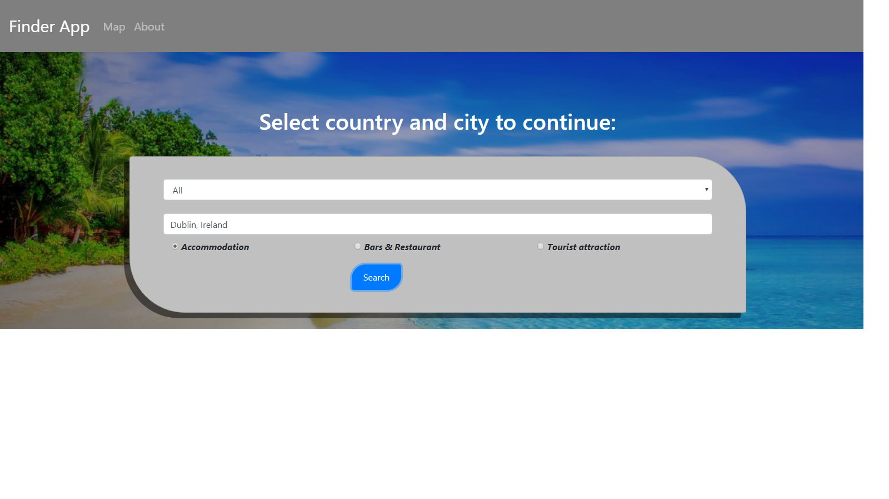

         ___        ______     ____ _                 _  ___  
        / \ \      / / ___|   / ___| | ___  _   _  __| |/ _ \ 
       / _ \ \ /\ / /\___ \  | |   | |/ _ \| | | |/ _` | (_) |
      / ___ \ V  V /  ___) | | |___| | (_) | |_| | (_| |\__, |
     /_/   \_\_/\_/  |____/   \____|_|\___/ \__,_|\__,_|  /_/ 
 ----------------------------------------------------------------- 

#  2nd Milestone project : Interactive Frontend Development Using Google Maps And Google Places API

## Finder-App

Finder App is a simple app created for those who loves travelling and would like to search different places near by,
This app is built by usisng Google Map API and Google places API. 
Also used autocomplete feature which can give a user suggestions to what they intend to search,
Autocomplet function can gives you suggestion when you start typind first letter and so on and this makes it
easy when you are not sure the spelling of a city.This app coveres three search areas 
                       
                        (1) Accomodation 
                        (2) Bars & Restaurant 
                        (3) Tourist Attractions
                        
## UX

The UX of that site consist of navbar at the top with logo on the lift side and two other fields MAP and ABOUT next to the
logo on the left side,As that web site is only one page so i created different section on the same page,fist section contains 
search card which contains two fields, In first field user can put the country name,I mentioned some selected country names but
there is an option to select ALL countries,In the second field user need to put the desired city name where he want to travell,
three buttons below the search area pointing out the three searching categories.

## Demo

## Technologies Used

* HTML 5 <rb>
* CSS 3
* JavaScript
* Bootstrap (3.4.1)
* Font Awesome (v4.7.0)
* jQuery (3.4.1)
* Google Maps API
* Google Fonts

## 

