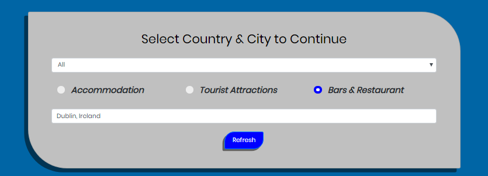
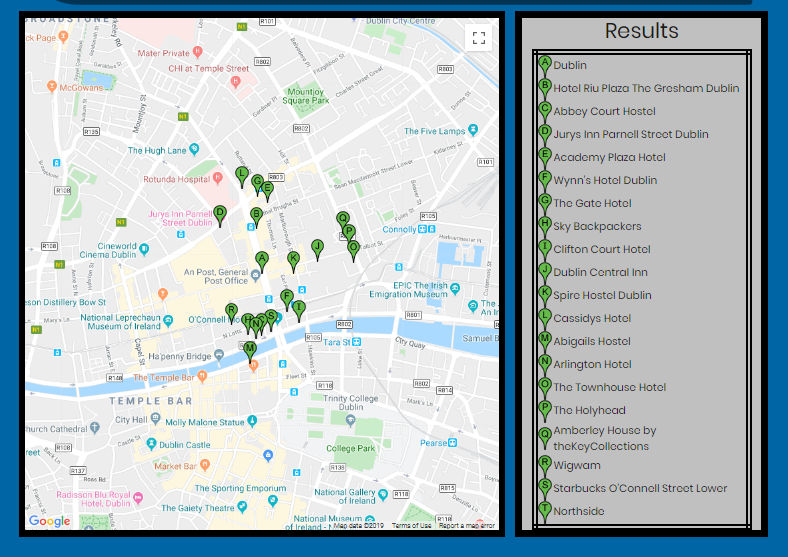

         ___        ______     ____ _                 _  ___  
        / \ \      / / ___|   / ___| | ___  _   _  __| |/ _ \ 
       / _ \ \ /\ / /\___ \  | |   | |/ _ \| | | |/ _` | (_) |
      / ___ \ V  V /  ___) | | |___| | (_) | |_| | (_| |\__, |
     /_/   \_\_/\_/  |____/   \____|_|\___/ \__,_|\__,_|  /_/ 
 ----------------------------------------------------------------- 

#  2nd Milestone project : Interactive Frontend Development Using Google Maps And Google Places API

## Finder-App

Finder App is a simple app created for those who loves travelling and would like to search different places near by,
This app is built by usisng Google Map API and Google places API. 
Also used autocomplete feature which can give a user suggestions to what they intend to search,
Autocomplet function can gives you suggestion when you start typind first letter and so on and this makes it
easy when you are not sure the spelling of a city.This app coveres three search areas 
                       
                        (1) Accomodation 
                        (2) Bars & Restaurant 
                        (3) Tourist Attractions
                        
## UX

I tried to make the UX of that site as simple as possible,so that the user can use it without any trouble,The UX of that site consist of navbar at the top with logo on the lift side and three other fields HOME MAP and ABOUT to the
right side of the nav bar,As that web site is only one page so i created different section on the same page,fist section contains 
search card which contains two fields, In first field user can put the country name,I mentioned some selected country names but
there is an option to select ALL countries,In the second field user need to put the desired city name where they want to travell,
three buttons below the search area pointing out the three searching categories.

## NavBar

## Search Bar

## Results

## Technologies Used

* HTML 5 This project uses HTML 5, CSS 3, and JavaScript programming languages.
* CSS 3 The project uses JQuery to simplify DOM manipulation.
* JavaScript
* Bootstrap (3.4.1)
* Font Awesome (v4.7.0)
* jQuery (3.4.1)
* Google Maps API
* Google Fonts

## Testing
I have tested that site through developer tools and checked on all devices provided on the google chrome dev tools for it's responsiveness and used W3C Code validator for testing all HTML code.

## Deployment

The site was built using Cloud's IDE, added, commited and pushed to GitHub using the terminal. A live version of the site is hosted on GitHub pages.
Deployment and source control was entirely done via GitHub. My repository can be found here:
https://github.com/Waseem1978?tab=repositories

The live site can be found here:
https://waseem1978.github.io/Finder-App

## Credits
* Youtube For bit of help with the navbar and the logos.
* JavaScript Code snippets used for Maps, markers and clearing the markers from Google Maps and Google Places API website.
* Google Developer Tools.
* HTML for forms, tables used were obtained from bootstrap libraries website.

#  MEDIA
The image used on this project is obtained through a simple Google search and screen shot of the project results are processed through Microsoft paint.

## Acknowledgements
A huge thanks to Tim Nelson for his time, suggestions, and constructive feedback for this project!
Also i am very thankful to tutor support for helping me out.

